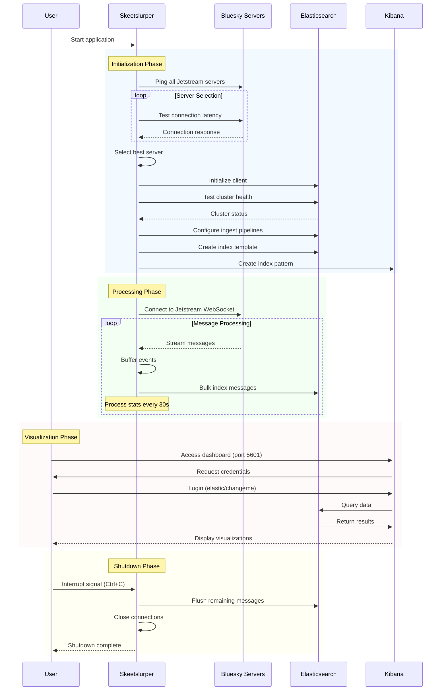

# Elastic Skeetslurper

skeeSuper basic tooling to slurp sweet skeet juice from Bluesky's Jetstream cluster, index them in Elasticsearch and visualise in Kibana.

Should take about 5 minutes to get up and running, no environment variables to set.

Uses docker-elk forked from https://github.com/deviantony/docker-elk, feel free to swap the git submodule out for your own ELK stack fork.

For more details see --> [What's going on?](##What's-going-on?)

## Prerequisites

- Go 1.22+
- Docker
- ~10Mbps internet connection
- Nothing listening on ports 5601, 9200, 9600


## Setup

### initialise submodules

```
git submodule update --init --recursive
```

### Spin up ELK containers

```
cd elk
docker compose up setup
docker compose up -d
cd ..
```

### Run skeetslurper

```
go run .
```

or

```
go build
chmod +x skeetslurper
./skeetslurper
```


## Open Kibana and take a look

Open the Kibana URL in your browser:

http://localhost:5601/

Login with the following credentials:

**Username:** elastic

**Password:** changeme


Do not expose this outside of your local network, you will instantly get hacked.

## TODO

- [ ] Figure out proper index mapping and how to handle Lexicon/schema changes
- [ ] Some nice prebuilt Bluesky Kibana dashboards

## What's going on?

